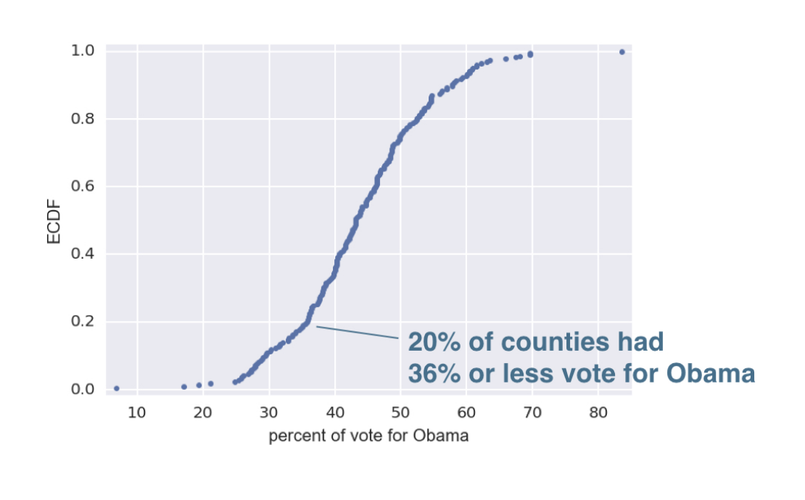

# Intro to EDA

1. Bee Swarm Plots

A problem with histograms is that the choice of bins is arbitrary and can create binning bias. You may interpret things differently. Another problem is that we are not plotting all the data, we are sweeping them into bins. 
 
A bee swarm plot is one way to helpsolve this problem. 

Data should be in a Pandas DF where each column is a feature and each row is an observation. Below is an example of creating a swarm plot:  

`# Create bee swarm plot with Seaborn's default settings`
`sns.swarmplot(x = 'species', y = 'petal length (cm)', data = df)`

`# Label the axes`
`plt.xlabel('Species')`

`# Show the plot`
`plt.ylabel('Petal Length (cm)')`

`plt.show()`  

2. Swarm plots can be unuseful when data points overlap and obfuscate data. A better option is the Empirical Cumulative Distribution function, aka ECDF. An ECDF is made up of an x-value which is the quantity we are measuring and a y-value which is the percent of the population of data points that have a value **less than** the corresponding x value.  

example:   
20% of the counties had less than 36% of the vote for Obama.  

On the x axis, our data must be sorted. We can use numpy.sort() function. On the y-axis, the values increment by .01 with a maximum y value of 1 (where all of the data would belying below a certain point)! We can use the np.arange() method for this. plt.margins(0.02) gives us a nice buffer around the plot. More than one ECDF can be plotted on the same plot! It is almost always the best first viz to plot. Below is the first steps in creating an ECDF plot:  

`def ecdf(data):`
`"""Compute ECDF for a one-dimensional array of measurements."""`
`    # Number of data points: n` 
`    n = len(data)` 

`    # x-data for the ECDF: x` 
`    x = np.sort(data)` 

`    # y-data for the ECDF: y` 
`    y = np.arange(1, n + 1) / n` 

`    return x, y` 
`# Compute ECDF for versicolor data: x_vers, y_vers`
`x_vers, y_vers = ecdf(versicolor_petal_length)`

`# Generate plot`
`plt.plot(x_vers, y_vers, marker='.', linestyle='none')`

`# Label the axes`
`plt.xlabel("Petal Length")`
`plt.ylabel("ECDF")`

`# Display the plot`
`plt.show()`
 
Here we plot the ecdf for three different types of plans: 

`# Compute ECDFs`
`x_set, y_set = ecdf(setosa_petal_length)`
`x_vers, y_vers = ecdf(versicolor_petal_length)`
`x_virg, y_virg = ecdf(virginica_petal_length)`

`# Plot all ECDFs on the same plot`
`plt.plot(x_set, y_set, marker='.', linestyle='none')`
`plt.plot(x_vers, y_vers, marker='.', linestyle='none')`
`plt.plot(x_virg, y_virg, marker='.', linestyle='none')`

`# Annotate the plot`
`plt.legend(('setosa', 'versicolor', 'virginica'), loc='lower right')`
`_ = plt.xlabel('petal length (cm)')`
`_ = plt.ylabel('ECDF')`

`# Display the plot`
`plt.show()`

