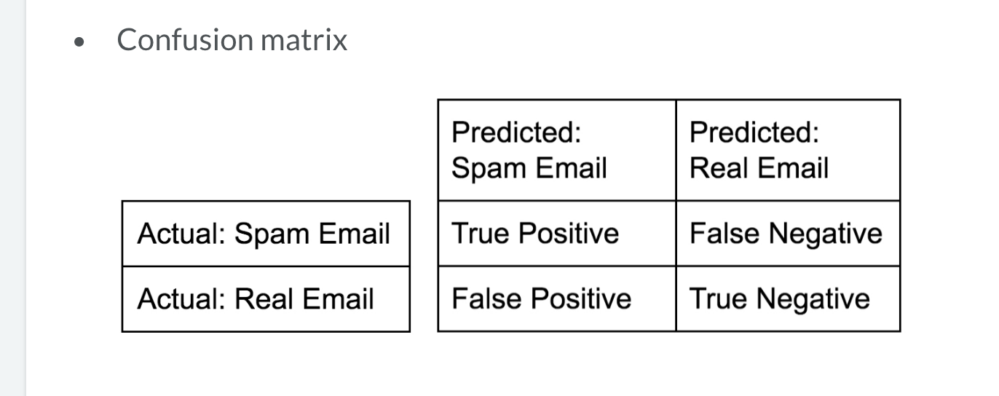

# How Good is a Model?

Use a confusion matrix w/ False Pos. and False Neg. for predicted vs. actual values. Example:  
 
Accuracy: Sum of the diagonal divided by the total sum of the matrix  
Precision: True positives divided by true positives plus false positives  
Recall: True positives divided by true positives plus false negatives  
F1score: (2*precision*recall)/(precision+recall)  

### Classification
`from sklearn.metrics import classification_report` 
`from sklearn.metrics import confusion_matrix` 
`# Create training and test set` 
`X_train, X_test, y_train, y_test = train_test_split(X, y, test_size=.4, random_state =42)` 

`# Instantiate a k-NN classifier: knn` 
`knn = KNeighborsClassifier(n_neighbors=6)` 

`# Fit the classifier to the training data` 
`knn.fit(X_train, y_train)` 

`# Predict the labels of the test data: y_pred` 
`y_pred = knn.predict(X_test)` 

`# Generate the confusion matrix and classification report` 
`print(classification_report(y_test, y_pred))` 
`print(confusion_matrix(y_test, y_pred))` 

### Log Reg Model  
`# Import the necessary modules` 
`from sklearn.linear_model import LogisticRegression` 
`from sklearn.metrics import confusion_matrix, classification_report` 

`# Create training and test sets` 
`X_train, X_test, y_train, y_test = train_test_split(X, y, test_size = 0.4, random_state=42)` 

`# Create the classifier: logreg` 
`logreg = LogisticRegression()` 

`# Fit the classifier to the training data` 
`logreg.fit(X_train, y_train)` 

`# Predict the labels of the test set: y_pred` 
`y_pred = logreg.predict(X_test)` 

`# Compute and print the confusion matrix and classification report` 
`print(confusion_matrix(y_test, y_pred))` 
`print(classification_report(y_test, y_pred))` 

### Plot a ROC Curve  
`# Import necessary modules` 
`from sklearn.metrics import roc_curve` 

`# Compute predicted probabilities: y_pred_prob` 
`y_pred_prob = logreg.predict_proba(X_test)[:,1]` 

`# Generate ROC curve values: fpr, tpr, thresholds` 
`fpr, tpr, thresholds = roc_curve(y_test, y_pred_prob)` 

`# Plot ROC curve` 
`plt.plot([0, 1], [0, 1], 'k--')` 
`plt.plot(fpr, tpr)` 
`plt.xlabel('False Positive Rate')` 
`plt.ylabel('True Positive Rate')` 
`plt.title('ROC Curve')` 
`plt.show()` 

### AUC Computation (Area under ROC Curve)

`# Import necessary modules`  
`from sklearn.metrics import roc_auc_score` 
`from sklearn.model_selection import cross_val_score` 

`# Compute predicted probabilities: y_pred_prob` 
`y_pred_prob = logreg.predict_proba(X_test)[:,1]` 

`# Compute and print AUC score` 
`print("AUC: {}".format(roc_auc_score(y_test, y_pred_prob)))` 

`# Compute cross-validated AUC scores: cv_auc` 
`cv_auc = cross_val_score(logreg, X, y, cv = 5, scoring = 'roc_auc')` 

`# Print list of AUC scores` 
`print("AUC scores computed using 5-fold cross-validation: {}".format(cv_auc))` 

### Hyperparameter Tuning w/ GridSearchCV 

`# Import necessary modules` 
`from sklearn.linear_model import LogisticRegression` 
`from sklearn.model_selection import GridSearchCV` 

`# Setup the hyperparameter grid` 
`c_space = np.logspace(-5, 8, 15)` 
`param_grid = {'C': c_space}` 

`# Instantiate a logistic regression classifier: logreg` 
`logreg = LogisticRegression()` 

`# Instantiate the GridSearchCV object: logreg_cv` 
`logreg_cv = GridSearchCV(logreg, param_grid, cv=5)` 

`# Fit it to the data` 
`logreg_cv.fit(X, y)` 

`# Print the tuned parameters and score` 
`print("Tuned Logistic Regression Parameters: {}".format(logreg_cv.best_params_))` 
`print("Best score is {}".format(logreg_cv.best_score_))` 

### Hyperparameter Tuning w/ RandomizedSearchCV 

`# Import necessary modules` 
`from scipy.stats import randint` 
`from sklearn.tree import DecisionTreeClassifier` 
`from sklearn.model_selection import RandomizedSearchCV` 

`# Setup the parameters and distributions to sample from: param_dist` 
`param_dist = {"max_depth": [3, None],
              "max_features": randint(1, 9),
              "min_samples_leaf": randint(1, 9),
              "criterion": ["gini", "entropy"]}` 

`# Instantiate a Decision Tree classifier: tree` 
`tree = DecisionTreeClassifier()` 

`# Instantiate the RandomizedSearchCV object: tree_cv` 
`tree_cv = RandomizedSearchCV(tree, param_dist, cv=5)` 

`# Fit it to the data` 
`tree_cv.fit(X, y)` 

`# Print the tuned parameters and score` 
`print("Tuned Decision Tree Parameters: {}".format(tree_cv.best_params_))` 
`print("Best score is {}".format(tree_cv.best_score_))` 

### Hold-out set in practice: Classification 

`# Import necessary modules` 
`from sklearn.model_selection import train_test_split` 
`from sklearn.linear_model import LogisticRegression`  
`from sklearn.model_selection import GridSearchCV` 

`# Create the hyperparameter grid` 
`c_space = np.logspace(-5, 8, 15)` 
`param_grid = {'C': c_space, 'penalty': ['l1', 'l2']}` 

`# Instantiate the logistic regression classifier: logreg` 
`logreg = LogisticRegression()` 

`# Create train and test sets` 
`X_train, X_test, y_train, y_test = train_test_split(X, y, random_state = 42, test_size = .4)` 

`# Instantiate the GridSearchCV object: logreg_cv` 
`logreg_cv = GridSearchCV(logreg, param_grid, cv = 5)` 

`# Fit it to the training data` 
`logreg_cv.fit(X_train, y_train)` 

`# Print the optimal parameters and best score` 
`print("Tuned Logistic Regression Parameter: {}".format(logreg_cv.best_params_))` 
`print("Tuned Logistic Regression Accuracy: {}".format(logreg_cv.best_score_))` 

### Hold-out set in practice: Regression

`# Import necessary modules` 
`from sklearn.linear_model import ElasticNet` 
`from sklearn.metrics import mean_squared_error` 
`from sklearn.model_selection import train_test_split, GridSearchCV` 

`# Create train and test sets` 
`X_train, X_test, y_train, y_test = train_test_split(X, y, test_size = .4, random_state = 42)` 

`# Create the hyperparameter grid` 
`l1_space = np.linspace(0, 1, 30)` 
`param_grid = {'l1_ratio': l1_space}` 

`# Instantiate the ElasticNet regressor: elastic_net` 
`elastic_net = ElasticNet()` 
`# Setup the GridSearchCV object: gm_cv` 
`gm_cv = GridSearchCV(elastic_net, param_grid, cv=5)` 

`# Fit it to the training data` 
`gm_cv.fit(X_train, y_train)` 

`# Predict on the test set and compute metrics` 
`y_pred = gm_cv.predict(X_test)` 
`r2 = gm_cv.score(X_test, y_test)` 
`mse = mean_squared_error(y_test, y_pred)` 
`print("Tuned ElasticNet l1 ratio: {}".format(gm_cv.best_params_))` 
`print("Tuned ElasticNet R squared: {}".format(r2))` 
`print("Tuned ElasticNet MSE: {}".format(mse)) `
